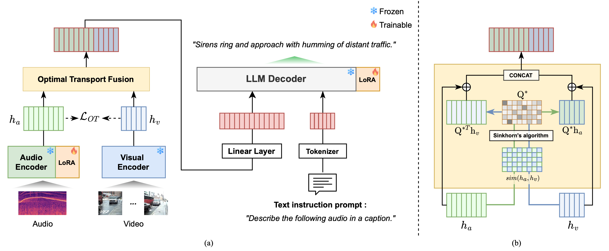

<h1 align="center"> LAVCap: LLM-based Audio-Visual Captioning using Optimal Transport
</h1>


<div align="center">
  Kyeongha&nbsp;Rho<sup>1*</sup> &ensp; <b>&middot;</b> &ensp;
  Hyeongkeun&nbsp;Lee<sup>1*</sup> &ensp; <b>&middot;</b> &ensp;
  Valentio&nbsp;Iverson<sup>2</sup> &ensp; <b>&middot;</b> &ensp;
  Joon Son&nbsp;Chung<sup>1</sup> &ensp; &ensp;<br>
  <sup>1</sup> KAIST &emsp; <sup>2</sup>University of Waterloo &emsp;<br>
  <sup>*</sup>Equal Contribution&emsp; <br>
</div>
<h3 align="center">[<a href="https://arxiv.org/pdf/2501.09291">arXiv</a>]</h3>
<br>


This repository contains the official implementation of [LAVCap: LLM-based Audio-Visual Captioning using Optimal Transport](https://arxiv.org/pdf/2501.09291), presented at **ICASSP 2025**. Our method introduces a novel approach to audio-visual captioning, achieving state-of-the-art performance on AudioCaps.

This implementation is specifically designed to run on **NVIDIA GPUs** and leverages GPU acceleration for efficient training and inference.

## Abstract

<div align="center">
<figure style="text-align: center;">
    
    <p><em>Fig. 1. (a) Overview of the proposed LAVCap Framework. (b) Detail of the Optimal Transport Fusion module.</em></p>
</figure>
</div>

Automated audio captioning is a task that generates textual descriptions for audio content, and recent studies have explored using visual information to enhance captioning quality. However, current methods often fail to effectively fuse audio and visual data, missing important semantic cues from each modality. To address this, we introduce LAVCap, a large language model (LLM)-based audio-visual captioning framework that effectively integrates visual information with audio to improve audio captioning performance. LAVCap employs an optimal transportbased alignment loss to bridge the modality gap between audio and visual features, enabling more effective semantic extraction. Additionally, we propose an optimal transport attention module that enhances audio-visual fusion using an optimal transport assignment map. Combined with the optimal training strategy, experimental results demonstrate that each component of our framework is effective. LAVCap outperforms existing state-of-the-art methods on the AudioCaps dataset, without relying on large datasets or post-processing.

## Prepare Environment & Dataset
Create conda environment
```
conda env create -f lavcap.yaml
conda activate lavcap
```


Please download and organize the [AudioCaps](https://audiocaps.github.io/) dataset in the required structure within the `dataset` folder. The preprocessed AudioCaps dataset is available here: [Train set](https://mmai.io/projects/LAVCap/train.tar.gz) & [Test set](https://mmai.io/projects/LAVCap/test.tar.gz). The visual features for each video, to be placed in the visual_feature folder, can be extracted using the ViT-L/14 pretrained weights and can be downloaded [here](https://mmai.io/projects/LAVCap/visual_feature.tar.gz). In addition, download the pretrained models used in this project, including CED as the audio encoder (to be placed in the `pretrained_weights/ced` folder) and LLaMA-2 as the foundational backbone (to be placed in the `pretrained_weights/Video-LLaMA-2-7B-Finetuned` folder). The CED model is available [here](https://github.com/RicherMans/CED?tab=readme-ov-file), and LLaMA-2 model can be downloaded from this [link](https://huggingface.co/meta-llama/Llama-2-7b-chat-hf).


```
LAVCap/
├── dataset/
|   ├── audiocaps/
|       ├── train/
│           ├── frames/
│           └── waveforms/
|       ├── test/
│           ├── frames/
│           └── waveforms/
|   ├── visual_feature/
|       ├── train/
|       ├── test/
|   ├── train.json
|   ├── test.json
|   ├── test_coco.json
│   └── torch2iid.json
│
├── pretrained_weights/
│   ├── ced/
│   └── Video-LLaMA-2-7B-Finetuned/
│
...
```


### Training
To train the LAVCap, run the command below:

```
python train.py --cfg-path configs/config_best.yaml
```


## Citation
If you find this repo helpful, please consider citing:
```
@article{rho2025lavcap,
  title={LAVCap: LLM-based Audio-Visual Captioning using Optimal Transport},
  author={Rho, Kyeongha and Lee, Hyeongkeun and Iverson, Valentio and Chung, Joon Son},
  journal={arXiv preprint arXiv:2501.09291},
  year={2025}
}
```

## Acknowledgement
This repo is built upon the framework of [SALMONN](https://github.com/bytedance/SALMONN), [LOAE](https://github.com/frankenliu/LOAE) and [AVCap](https://github.com/JongSuk1/AVCap?tab=readme-ov-file).
